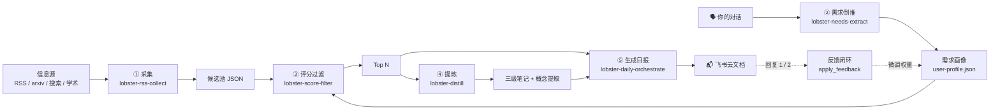

# 🦞 龙虾日报 · Lobster Daily

> **越聊越懂你的 AI 定制日报** — 把信息洪流，过滤成每天 5 条你真正需要的内容。

<div align="center">


**开源 · 个性化 · 需求驱动 · 零第三方依赖**

</div>

---

## ✨ 为什么是它

信息爆炸的时代，**问题不是没内容，而是没时间筛**。

龙虾日报是一套运行在本地的开源信息筛选流水线——它不猜你喜欢，而是**听你说过什么**：

```
🗣️ 你和系统聊得越多
   ↓
🧠 需求画像越来越准
   ↓
📬 每天推给你的，才是你真正需要的
```

**核心机制**：扫描对话 → 提取需求信号（显式 + 隐式）→ 更新画像 → 画像给候选评分 → 只推相关的。

---

## 🏗️ 架构（五层解耦，每层可替换）

由 5 个可独立复用的 skill 组成：

| # | Skill | 职责 | 阶段 |
|---|-------|------|------|
| 1 | `lobster-rss-collect` | 多源采集（19 个 RSS，含 3 个 arxiv + 搜索/学术通道） | ① 采集 |
| 2 | `lobster-needs-extract` | 需求倒推（对话 → 需求画像） | ② 需求 |
| 3 | `lobster-score-filter` | 评分过滤（tier 加权 → Top N + 命中日志） | ③ 评分 |
| 4 | `lobster-distill` | 提炼（三级笔记 + 概念提取） | ④ 提炼 |
| 5 | `lobster-daily-orchestrate` | 编排推送（全流程 → 飞书云文档） | ⑤ 推送 |



**信息层级意识**（tier）—— 一手/二手/三手：
- 🥇 **一手源**（tier 1）：论文 / 官方公告 / 当事人博客 —— arxiv、Semantic Scholar
- 🥈 **二手源**（tier 2）：人工策展聚合 —— 有判断力介入
- 🥉 **三手源**（tier 3）：投票 / 算法聚合 —— 纯排序

评分按 tier 加权，一手源天然有优势，但不过度 —— tier 加成独立于质量分 5.0 封顶。

---

## 🚀 快速开始（3 步）

### 1. 安装 skill

```bash
cp -R lobster-*/ ~/.agents/skills/
```

### 2. 配置信息源

编辑 `lobster-rss-collect/config/sources.yaml`：

```yaml
rss_feeds:
  - name: simonwillison
    url: https://simonwillison.net/atom/everything/
    category: ai
    priority: high
    tier: 1        # 一手源
```

### 3. 一键跑全流程

```bash
# 基础版
python3 lobster-daily-orchestrate/scripts/run_daily.py --dry-run

# 完整版（学术搜索 + 提炼任务 + 飞书推送）
python3 lobster-daily-orchestrate/scripts/run_daily.py --with-scholar --with-distill --push-feishu
```

> 支持 cron 定时：每天早上 8:00 自动推送 → 飞书云文档链接。

---

## 📖 日报长什么样

最终交付物是**飞书云文档链接**，内含：

```markdown
# 🦞 龙虾日报（Claw Daily · YYYYMMDD 期）
## 📊 今日总览       ← 入选篇数、主题分布
## 📖 今日精选       ← 每篇：标题/来源/评分/摘要/链接
                      + 📝 三级笔记（主旨/问题/论证骨架/边界）
                      + 🧠 概念提取（原话/费曼解释/架构图）
## 💡 推荐理由       ← 每篇一句，关联你的需求画像
## 👀 反馈           ← 回复 1 有用 / 2 没用，明天更准
```

---

## 🔄 反馈闭环（3→6）

日报不是单向推送，而是**越用越懂你的闭环**：

1. **📮 反馈入口** — 日报末尾：回复 `1` = 有用 / `2` = 没用
2. **🛡️ 防污染写入** — 同向连续 2 次反馈才生效（防误触），±0.2 小幅调整，权重钳制 1.0–5.0，改前自动备份可回滚
3. **📉 每周回顾** — 扫描连续 7 天未命中的需求，给出降权/淘汰建议（淘汰由人决定）

```bash
python3 lobster-daily-orchestrate/scripts/apply_feedback.py \
  --profile lobster-needs-extract/data/user-profile.json \
  --keyword Codex --action up

python3 lobster-daily-orchestrate/scripts/review_stale_needs.py \
  --hits-log /tmp/lobster-daily-run/hits-log.jsonl \
  --profile lobster-needs-extract/data/user-profile.json --days 7
```

---

## 🧠 设计理念

- **万物皆可 RSS**：所有源统一走采集层，一个解析器吃遍
- **零第三方依赖**：纯 Python 标准库，clone 就能跑
- **改配置不改代码**：加源只改 `sources.yaml`
- **越聊越懂**：需求画像持续更新，时间衰减 + 置信度
- **少而精**：默认源宁缺毋滥，评分阈值可调
- **开源泛化**：源配置不为单一画像服务，skill 可复用

## 🧰 技术亮点

1. **词边界排除**：`exclude_titles` 用正则词边界 —— "A Survey" 不会误伤 "Counterfactual Surveying"
2. **评分防封顶**：tier 加成在 total 外层，不进 quality 5.0 封顶
3. **限速合规**：Semantic Scholar 无 key 限速 100 req/5min → 3s/req 间隔
4. **反馈防污染**：pending 计数 + 同向 2 次生效 + 备份回滚
5. **命中日志**：每次入选 Top 记录命中了哪些需求 → 支撑每周回顾

---

## 🗺️ Roadmap

- [x] tier 信息层级 + arxiv 一手源
- [x] Semantic Scholar 学术搜索通道
- [x] 反馈闭环三步
- [ ] 概念回流画像（读到的内容反向强化需求）
- [ ] `--add-url` 手动提交入口
- [ ] 播客转写独立 skill

---

## 📦 交付物结构

```
lobster-daily/
├── lobster-rss-collect/      # ① 采集
│   ├── config/sources.yaml   #    源配置（tier 标注）
│   └── scripts/fetch_rss.py + search_collect.py
├── lobster-needs-extract/    # ② 需求
│   ├── scripts/extract_needs.py
│   └── data/user-profile.json #    首次运行时生成
├── lobster-score-filter/     # ③ 评分
│   └── scripts/score_filter.py
├── lobster-distill/          # ④ 提炼
│   └── scripts/distill.py
├── lobster-daily-orchestrate/ # ⑤ 编排
│   ├── scripts/run_daily.py + build_daily.py
│   ├── scripts/apply_feedback.py + review_stale_needs.py
│   └── scripts/push_feishu.py + render_mermaid.py
├── README.md
├── USAGE.md
└── LICENSE (MIT)
```

## 📄 License

MIT — 自由使用，欢迎共建。

---

<div align="center">

**🦞 砍比建难，减比加有用。** — 少而精，才是信息时代的奢侈品。

</div>
